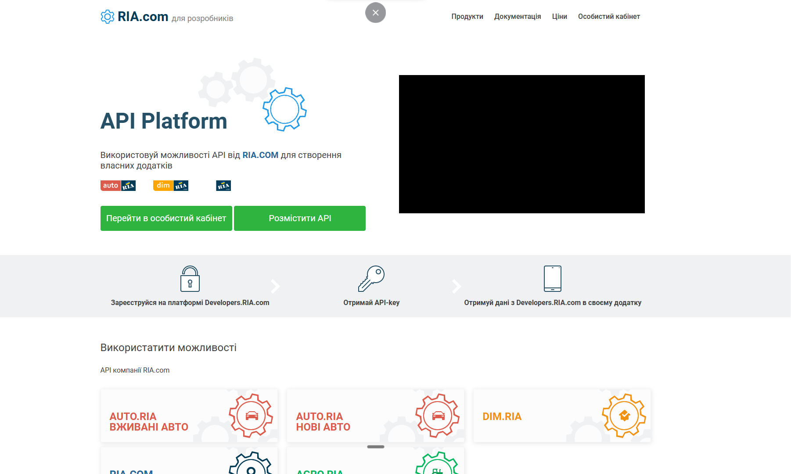
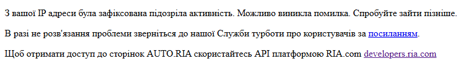

[Перейти до Української версії](#ukrainian-version) | [Перейти к Русской версии](#russian-version)

---

<a name="ukrainian-version"></a>
# AutoRia Scraper (Українська версія)

## Лучше всего использовать офииальный API AutoRia

Веб-скрейпер на Python для збору даних про оголошення автомобілів з AutoRia (auto.ria.com), їх зберігання в базі даних PostgreSQL без дублікатів та щоденного створення дампів бази даних.

## Ключові Функції

- **Щоденний запланований скрапінг** з налаштовуваним часом
- **Зберігання в PostgreSQL** без дублікатів (UPSERT)
- **Щоденні дампи бази даних** у каталозі `dumps/`
- **Асинхронні операції** для високої продуктивності
- **API для телефонних номерів** замість повільного парсингу
- **Docker Compose** для легкого розгортання
- **Стійкість до змін UI** з резервними селекторами

<a name="api-screenshots"></a>
## Скріншоти API


_Приклад API запиту до AUTO.RIA для отримання телефонних номерів._


_Можлива помилка, коли API не повертає телефонний номер._

## Поля Бази Даних

`url`, `title`, `price_usd`, `odometer`, `username`, `phone_number`, `image_url`, `images_count`, `car_number`, `car_vin`, `datetime_found`

## Швидкий Старт

### 1. Створіть файл `.env`

Скопіюйте `env.example` в `.env` і заповніть своїми даними

### 2. Запуск через Docker (Рекомендовано)

```bash
make start    # Запустити сервіси
make logs     # Переглянути логи
make down     # Зупинити сервіси
make rebuild  # Перебудувати та перезапустити
```

### 3. Запуск безпосередньо

```bash
pip install -r scraper/requirements.txt
python scraper/main.py
```

---

<a name="russian-version"></a>
# AutoRia Scraper (Русская версия)

## Лучше всего использовать офииальный API AutoRia

Веб-скрепер на Python для сбора данных об автомобильных объявлениях с AutoRia (auto.ria.com), их хранения в базе данных PostgreSQL без дубликатов и ежедневного создания дампов базы данных.

## Ключевые Функции

- **Ежедневный запланированный скрапинг** с настраиваемым временем
- **Хранение в PostgreSQL** без дубликатов (UPSERT)
- **Ежедневные дампы базы данных** в каталоге `dumps/`
- **Асинхронные операции** для высокой производительности
- **API для телефонных номеров** вместо медленного парсинга
- **Docker Compose** для легкого развертывания
- **Устойчивость к изменениям UI** с резервными селекторами

<a name="api-screenshots-ru"></a>
## Скриншоты API


_Пример API запроса к AUTO.RIA для получения телефонных номеров._


_Возможная ошибка, когда API не возвращает телефонный номер._

## Поля Базы Данных

`url`, `title`, `price_usd`, `odometer`, `username`, `phone_number`, `image_url`, `images_count`, `car_number`, `car_vin`, `datetime_found`

## Быстрый Старт

### 1. Создайте файл `.env`

Скопируйте `env.example` в `.env` и заполните своими данными

### 2. Запуск через Docker (Рекомендуется)

```bash
make start    # Запустить сервисы
make logs     # Просмотреть логи
make down     # Остановить сервисы
make rebuild  # Пересобрать и перезапустить
```

### 3. Запуск напрямую

```bash
pip install -r scraper/requirements.txt
python scraper/main.py
``` 